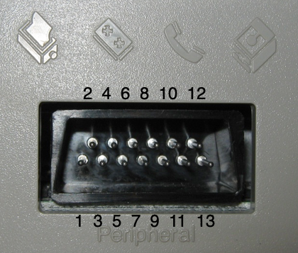

# ATARI CIO

## 1. Connector

  1. Clock Input
  1. Clock Output
  1. Data Input
  1. Ground
  1. Data Output
  1. Ground
  1. Command
  1. Motor Control
  1. Proceed
  1. +5V/Ready
  1. Audio Input
  1. +12V
  1. Interrupt
