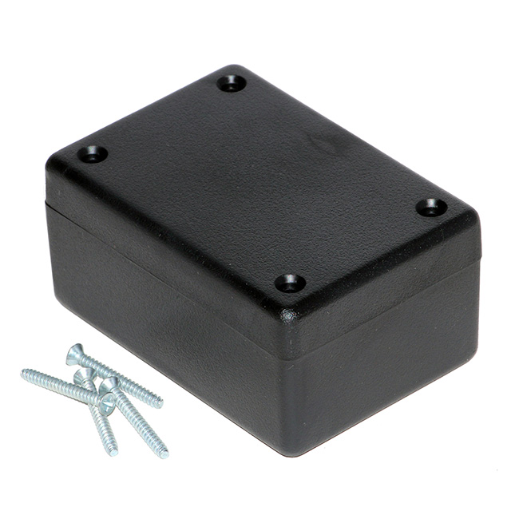

# Atari Joystick

## Basic digital joystick components

### Box 1594BSBK
    

  - https://www.digikey.cz/cs/products/detail/hammond-manufacturing/1594BSBK/2359729
  - https://www.conrad.cz/cs/p/hammond-electronics-1594bsbk-univerzalni-pouzdro-abs-cerna-1-ks-485645.html?srsltid=AfmBOopiYO-7DJXyb_yzzchNldlSvDTvW6tsdlEAoEYamgsDlkMVpits

## Optional extension for USB connection

### Arduino Leonardo/Micro (ATmega32u4 based Arduino)

  - The source code can be downloaded [here](Arduino/joystick.ino)
