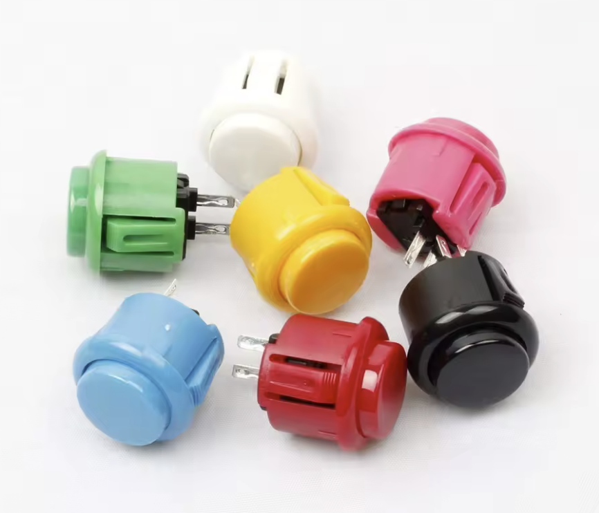

# Atari Joystick

## Basic digital joystick components

### Box 1594BSBK
    

  - https://www.digikey.cz/cs/products/detail/hammond-manufacturing/1594BSBK/2359729
  - https://www.conrad.cz/cs/p/hammond-electronics-1594bsbk-univerzalni-pouzdro-abs-cerna-1-ks-485645.html?srsltid=AfmBOopiYO-7DJXyb_yzzchNldlSvDTvW6tsdlEAoEYamgsDlkMVpits

### 8-way self reseting joystick switch standard CHKF-CV4-YQ-04R2GV4

  - https://www.aliexpress.com/item/1005006988200745.html?spm=a2g0o.order_list.order_list_main.97.3f5c1802a7BpK5

### Button

12pcs copy Sanwa Buttons 30mm 24mm Arcade Push Button Switch Baolian Circle Buttons Micro Switch For Arcade DIY Kit

  - https://www.aliexpress.com/item/1005005672031620.html?spm=a2g0o.order_detail.order_detail_item.5.69b6f19cupZg7H

### Cable

  - https://www.aliexpress.com/item/32987405868.html?spm=a2g0o.order_list.order_list_main.45.3f5c1802a7BpK5

## Optional extension for USB connection

### Arduino Leonardo/Micro (ATmega32u4 based Arduino)

  - The source code can be downloaded [here](Arduino/joystick.ino)
