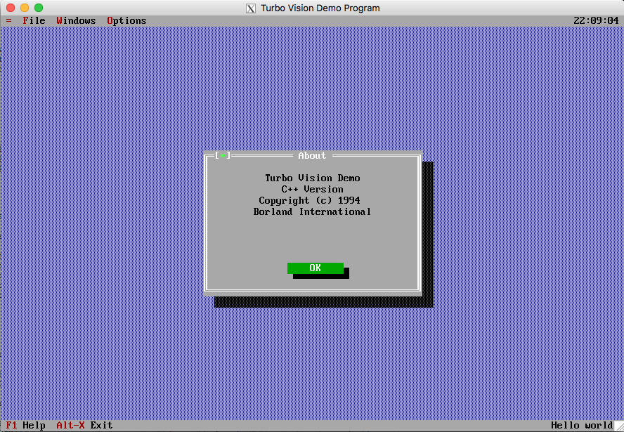

# Turbo Vision

## FAQ
  * [FAQ 1/3](faq1.md)
  * [FAQ 2/3](faq2.md)
  * [FAQ 3/3](faq3.md)

## TechInfo
  * [TI1006](TI1006.md): overlaying Turbo Vision (1992.08.12)
  * [TI1011](TI1011.md): modal and Modeless Dialog Boxes using Turbo Vision (1992.08.12)
  * [TI1013](TI1013.md): making string lists using Turbo Vision (1992.08.12)
  * [TI1020](TI1020.md): understanding & Using Turbo Vision's Palette (1992.08.21)
  * [TI1021](TI1021.md): how to extract text from a TEditor Buffer (1992.10.23)
  * [TI1022](TI1022.md): initialization Order of Objects & Turbo Vision (1992.12.03)
  * [TI1023](TI1023.md): persistent Objects using Turbo Vision (1992.12.23)
  * [TI1025](TI1025.md): optimizing Screen Updates with Turbo Vision v3.1 (1992.12.23)
  * [TI1033](TI1033.md): example of derived TListViewer for Turbo Vision (1992.12.23)
  * [TI1158](TI1158.md): a modal dialog from a modal dialog with Turbo Vision (1992.11.11)
  * [TI1159](TI1159.md): graying Buttons with Turbo Vision (1992.11.11)
  * [TI1160](TI1160.md): dynamically modifying Turbo Vision menus (1992.12.03)
  * [TI1296](TI1296.md): using Turbo Vision resource files (1993.10.25)
  * [TI1297](TI1297.md): example of password entry using a TInputLine (1993.10.25)
  * [TI1369](TI1369.md): changing the color of shadows in Turbo Vision (1993.10.25)
  * [TI1395](TI1395.md): how to use HeapView in a Turbo Vision program (1993.10.25)
  * [TI1398](TI1398.md): Tools.h++ from Rogue Wave conflicts with Turbo Vision (1993.10.25)
  * [TI1532](TI1532.md): continuously updated message box in Turbo Vision (1992.12.03)
  * [TI1541](TI1541.md): using cmReleasedFocus message to update a dialog box (1993.10.25)
  * [TI1549](TI1549.md): switching between text video modes in Turbo Vision (1993.10.25)
  * [TI1552](TI1552.md): Turbo Vision example of determining cursor position (1993.10.25)
  * [TI1553](TI1553.md): how to override freeItem for Collections (1993.10.25)
  * [TI1554](TI1554.md): context sensitive help example (Turbo Vision) (1993.08.30)
  * [TI1555](TI1555.md): example of a restricted InputLine (Turbo Vision) (1993.10.25)
  * [TI1557](TI1557.md): creating red error dialog boxes in Turbo Vision (1993.10.25)
  * [TI1558](TI1558.md): saving/restoring the mouse state in Turbo Vision (1993.09.01)
  * [TI1701](TI1701.md): Turbo Vision: streaming a user defined dialog (1993.10.07)
  * [TI1707](TI1707.md): broadcast to close a Turbo Vision Modeless Dialog (1993.10.12)
  * [TI1708](TI1708.md): using setData to initialize dialog box contents (1993.10.25)
  * [TI1712](TI1712.md): Turbo Vision Dialog Box (Modal/Modeless) Examples (1993.10.25)
  * [TI1720](TI1720.md): how to disable a button in Turbo Vision (1993.10.25)
  * [TI1730](TI1730.md): inserting text into a Turbo Vision window (1993.10.21)
  * [TI1752](TI1752.md): rebuilding Turbo Vision 1.0x with Borland C++ 4.0 (1994.01.13)
  * [TI1753](TI1753.md): using Turbo Vision 1.0x with Borland C++ 4.0 (1994.01.13)
  * [TI1773](TI1773.md): how to build DOS applications in Borland C++ 4.0 (1994.01.25)
  * [TI1778](TI1778.md): common questions and answers about Borland C++ 4.0 (1994.02.17)

